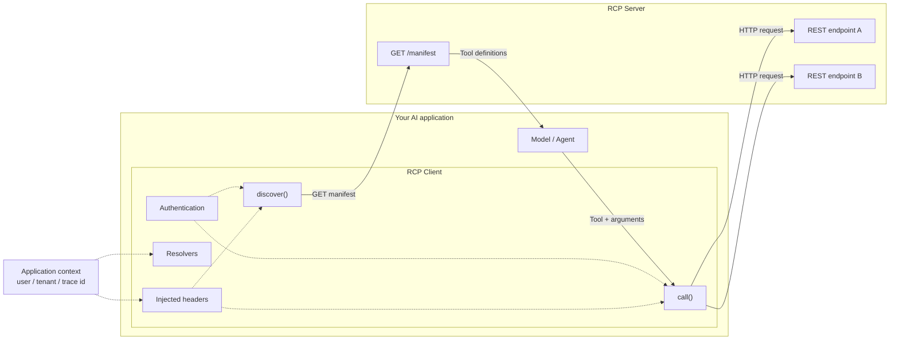
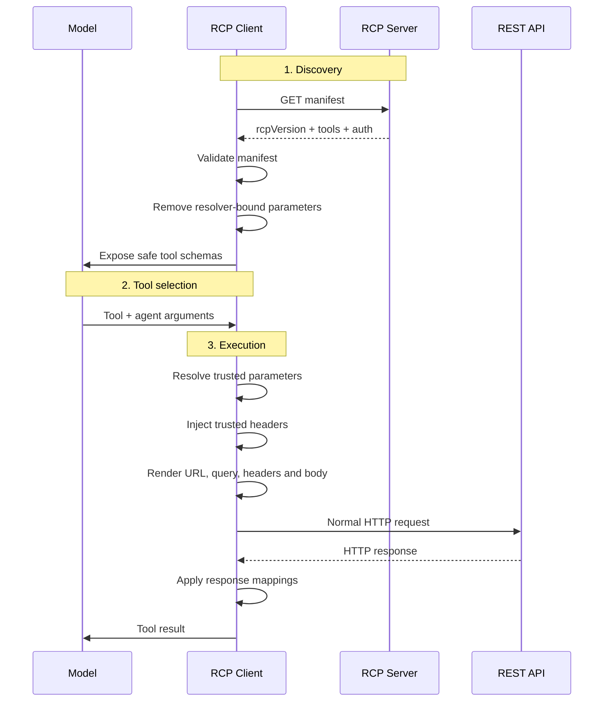

# RCP — REST Connector Protocol

> **Your REST API is already the tool.**

RCP is a lightweight, open protocol for making existing REST APIs **AI-callable and discoverable** without rebuilding your backend around a dedicated protocol server.

**The shortest path from REST to AI.**

[](https://www.npmjs.com/package/rcp-sdk)
[](https://github.com/hasanraiyan/rcp)

---

## The idea

You already have an API:

```text
GET  /users
GET  /orders
POST /orders
GET  /products
```

Why build another server just so an AI application can use it?

With RCP, your server publishes a simple JSON manifest describing the endpoints that can be exposed as tools.

```text
Existing REST API
       │
       ▼
   RCP Manifest
       │
       ▼
  AI Tool Discovery
       │
       ▼
   Model / Agent
       │
       ▼
 Normal HTTP Request
       │
       ▼
Your existing REST API
```

No backend rewrite.

No JSON-RPC.

No persistent connection.

No new application protocol server.

Just a manifest and normal HTTP.

---

# 🚀 Quick Start

Install the TypeScript reference implementation:

```bash
npm install rcp-sdk
```

Discover tools from an RCP manifest:

```ts
import { RCPClient } from "rcp-sdk";

const client = new RCPClient();

const tools = await client.discover(
  "https://api.example.com/manifest"
);
```

The client receives the available tools and can expose them to your AI application.

For example, an API might publish:

```json
{
  "rcpVersion": "0.1",
  "tools": [
    {
      "name": "list_orders",
      "description": "List the current user's orders",
      "method": "GET",
      "url": "https://api.example.com/orders",
      "exposedParams": {
        "limit": {
          "type": "integer"
        }
      }
    }
  ]
}
```

The model sees the safe, exposed parameters.

It does **not** see resolver-bound parameters such as `userId` or `tenantId`.

The RCP client then makes the ordinary HTTP request:

```http
GET /orders?limit=5
```

Your existing API handles the request exactly as it normally would.

---

# 🧠 How RCP Works

RCP has two primary roles:

```text
┌─────────────────────┐
│    AI Application   │
│                     │
│  Model / Agent      │
│        │            │
│        ▼            │
│    RCP Client       │
└─────────┬───────────┘
          │
          │ GET manifest
          ▼
┌─────────────────────┐
│     RCP Server      │
│                     │
│  /manifest          │
│                     │
│  Tool definitions   │
└─────────────────────┘
          │
          │
          ▼
   Existing REST API
```

The RCP server does not need to proxy tool execution.

The manifest is simply a **directory of capabilities**.

When the model chooses a tool, the RCP client calls that tool's own URL directly.

```text
Client                         Server
------                         ------

GET /manifest  ────────────►  RCP manifest

                    ◄──────── tool definitions

Model selects tool

GET /orders?limit=5 ───────►  Existing REST endpoint

                    ◄──────── normal HTTP response
```

The manifest URL and tool URLs can even live on different hosts.

---

# 🏗️ Architecture



RCP keeps the architecture deliberately simple:

**Discovery is RCP. Execution is HTTP.**

---

# 🔐 Resolver-Bound Parameters

One of the most important parts of RCP is the distinction between **agent-controlled arguments** and **application-controlled context**.

Consider an endpoint:

```http
GET /orders
```

It may require:

```text
userId
limit
status
```

The model should be allowed to choose:

```text
limit
status
```

But it should not be allowed to choose:

```text
userId
```

RCP handles this through **resolvers**.

```text
                MODEL
                  │
                  │ agent arguments
                  ▼
             ┌─────────┐
             │ RCP     │
             │ Client  │
             └────┬────┘
                  │
          ┌───────┴────────┐
          │                │
          ▼                ▼
     agentArgs          resolvers
          │                │
       limit              userId
       status          ← application
          │                context
          └───────┬────────┘
                  ▼
              HTTP Request
                  │
                  ▼
             REST API
```

A resolver-bound parameter is removed from the model-facing tool schema during discovery.

That means the model cannot:

* see the parameter
* provide the parameter
* override the parameter
* spoof the parameter

The application supplies it from trusted context.

For example:

```ts
{
  userId: (ctx) => ctx.user.id
}
```

The model only sees:

```json
{
  "limit": 5,
  "status": "pending"
}
```

The final request can contain:

```http
GET /orders?userId=123&limit=5&status=pending
```

This makes resolver-bound values useful for:

* `userId`
* `tenantId`
* `organizationId`
* `traceId`
* internal service identifiers
* application context

> **Don't give the model control over what the model shouldn't control.**

---

# 🔄 Request Lifecycle

RCP separates discovery from execution.



The important boundary is:

```text
                 Discovery
                    │
                    ▼
        ┌─────────────────────┐
        │ Remove resolver     │
        │ bound parameters    │
        └──────────┬──────────┘
                   │
                   ▼
                 Model
                   │
             safe arguments
                   │
                   ▼
              RCP Client
                   │
       + trusted application context
                   │
                   ▼
              REST API
```

---

# ⚡ Why RCP?

Most APIs are already built around HTTP.

You might already have:

```text
Express
FastAPI
Django
Rails
NestJS
Hono
Go
Rust
.NET
```

And your API already exposes useful capabilities.

RCP doesn't ask you to replace that architecture.

Instead:

```text
Your API
   │
   │ existing endpoints
   ▼
RCP manifest
   │
   ▼
AI application
```

### RCP focuses on one problem:

> **How do I make an existing REST API discoverable and callable by an AI application?**

Nothing more.

That constraint is intentional.

---

# RCP vs MCP

RCP is **not intended to replace MCP**.

They solve different problems.

|                            | RCP          | MCP                     |
| -------------------------- | ------------ | ----------------------- |
| Existing REST API          | ⭐⭐⭐⭐⭐        | Requires integration    |
| Dedicated protocol server  | Not required | Common deployment model |
| Transport                  | HTTP         | Multiple transports     |
| Persistent connection      | No           | Depends on transport    |
| JSON-RPC                   | No           | Yes                     |
| Stateful capabilities      | Limited      | ⭐⭐⭐⭐⭐                   |
| Simple REST integration    | ⭐⭐⭐⭐⭐        | More infrastructure     |
| Rich protocol capabilities | Focused      | ⭐⭐⭐⭐⭐                   |

A useful way to think about it:

```text
Have a complex, stateful integration?

                 ──► MCP

Already have a REST API and want AI access?

                 ──► RCP
```

**RCP is the shortest path from REST to AI.**

---

# 🧩 The Manifest

An RCP manifest describes the tools available to an AI application.

At minimum, it communicates:

```text
RCP version
Authentication
Available tools
Tool parameters
Tool URLs
HTTP methods
```

Conceptually:

```json
{
  "rcpVersion": "0.1",
  "auth": {
    "type": "header"
  },
  "tools": [
    {
      "name": "get_users",
      "description": "Get users",
      "method": "GET",
      "url": "https://api.example.com/users"
    }
  ]
}
```

The manifest is intentionally plain JSON.

There is no requirement for a persistent protocol connection.

---

# 🔑 Authentication

RCP supports authentication declarations so the client knows how requests should be authenticated.

Current protocol concepts include:

```text
none
header
oauth2
```

Authentication credentials remain client/application concerns.

They should never be exposed as model-controlled tool parameters.

> Authentication is part of the trust boundary, not part of the model's tool input.

OAuth2 is specified by the protocol but is not yet implemented by the TypeScript reference client.

---

# 📨 Header Injection

RCP can also inject application-controlled headers.

This is useful for values such as:

```text
Authorization
X-User-ID
X-Tenant-ID
X-Request-ID
X-Trace-ID
```

The application supplies these values through trusted context rather than asking the model to generate them.

---

# 🎯 Response Mappings

RCP can optionally transform an HTTP response before returning it to the model.

This allows an API to return:

```json
{
  "data": {
    "orders": [...]
  },
  "metadata": {
    "total": 25
  }
}
```

while exposing only the useful portion to the model.

For example:

```text
HTTP response
      │
      ▼
responseMappings
      │
      ▼
Tool result
      │
      ▼
Model
```

This keeps the AI-facing result focused without requiring changes to the underlying API.

---

# 🛠️ TypeScript SDK

The TypeScript implementation is currently the **reference implementation** of RCP.

```text
typescript/
├── src/
├── tests/
├── README.md
└── package.json
```

Package:

```bash
npm install rcp-sdk
```

The SDK provides the client-side functionality required to:

* discover RCP manifests
* validate protocol information
* construct AI-facing tools
* resolve application context
* inject headers
* execute REST requests
* apply response mappings

---

# 📁 Repository Structure

```text
rcp/
│
├── README.md
├── SPEC.md
├── SECURITY.md
├── ROADMAP.md
├── CONTRIBUTING.md
├── LICENSE
│
├── typescript/
│   ├── src/
│   ├── tests/
│   ├── README.md
│   └── package.json
│
├── examples/
│   ├── express/
│   ├── fastapi/
│   └── nextjs/
│
└── docs/
    ├── concepts/
    ├── authentication/
    ├── resolvers/
    └── security/
```

Each language implementation can remain independent while implementing the same protocol and manifest format.

---

# 🔭 Roadmap

## RCP v0.1

* [x] Manifest format
* [x] Tool discovery
* [x] HTTP execution
* [x] Resolver-bound parameters
* [x] Header injection
* [x] Response mappings
* [x] TypeScript reference SDK
* [x] Basic authentication model
* [ ] OAuth2 reference implementation
* [ ] Playground
* [ ] CLI

## RCP v0.2

* [ ] Python SDK
* [ ] RCP Inspector
* [ ] CLI tooling
* [ ] Conformance tests
* [ ] Improved validation
* [ ] Expanded security specification
* [ ] Framework examples
* [ ] Better developer tooling

## RCP v1.0

* [ ] Stable specification
* [ ] Multiple independent implementations
* [ ] Conformance suite
* [ ] Security review
* [ ] Versioning guarantees
* [ ] Production ecosystem

The goal is not to rush toward v1.0.

A protocol needs to be **simple, predictable and trustworthy** before it needs to be feature-complete.

---

# 🧪 Status

**RCP v0.1 — Active Design**

RCP is an early-stage protocol and is still evolving.

The specification, SDK APIs and security model may change before v1.0.

See [`ROADMAP.md`](./ROADMAP.md) for the current implementation status.

---

# 🤝 Contributing

RCP is being developed as an open protocol.

Contributions are welcome, especially around:

* protocol design
* security
* SDK implementations
* framework integrations
* examples
* documentation
* interoperability testing

If you're building something with RCP, opening an issue or discussion is a great way to share it.

---

# 📜 License

See [`LICENSE`](./LICENSE).

---

# The simplest way to remember RCP

```text
             REST API
                 │
                 │
          RCP Manifest
                 │
                 ▼
          AI Tool Discovery
                 │
                 ▼
             AI Agent
                 │
                 ▼
          Normal HTTP Call
                 │
                 ▼
             REST API
```

**Your REST API is already the tool.**

### RCP — The shortest path from REST to AI.
