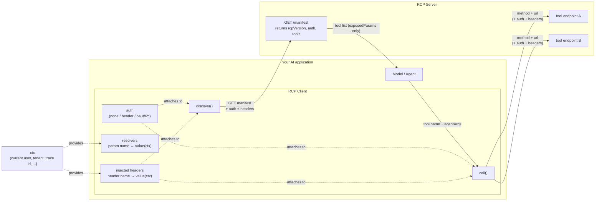
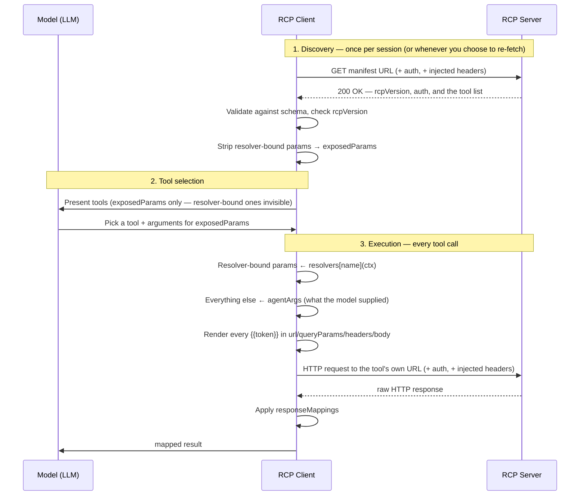

# RCP — REST Connector Protocol

A lightweight, open protocol for exposing REST APIs as AI-callable tools — without running a
protocol server. If MCP is the right fit when you need rich, stateful capabilities, RCP is for the
much more common case: you already have a REST API, and you just want an AI application to be able
to call some of its endpoints as tools.

## The shape of it

A **server** publishes a plain JSON manifest at a URL. A **client** fetches it, builds callable
tools from it, and calls the endpoints it describes directly — no JSON-RPC, no persistent
connection.

```
Client                             Server
------                             ------
GET  <manifest-url>          -->  200 { "rcpVersion": "0.1", "tools": [...] }
...model picks a tool...
<method> <tool's own url>    -->  (whatever that endpoint normally returns)
```

## Architecture

Two roles, no third "host" layer, no persistent connection — every interaction is a plain,
stateless HTTP request:



*`oauth2` is fully specified in the protocol but not yet implemented by the reference client — see
`typescript/README.md`'s Status section.*

The key architectural point resolvers exist to enforce: **a resolver-bound param never reaches the
model** — it's removed from the tool schema at discovery time, not just hidden by convention. The
sequence below shows exactly where that happens relative to everything else:



Two things worth noticing in that diagram: **discovery and execution hit different places** (the
manifest URL is only ever a directory — the model's tool call goes straight to the tool's own
`url`, which can be an entirely different host), and **resolver values are computed after the model
has already picked a tool** — the model never had the option to supply them, spoof them, or even
see that they exist.

## SDKs

Each language implementation lives in its own top-level folder — same protocol, same manifest
shape, independent tooling/build/versioning per language:

- [`typescript/`](./typescript) — `rcp-sdk`, the reference implementation. Start here.

More languages may be added the same way later (e.g. a `python/` folder), each self-contained with
its own package manifest, tests, and docs.

## Status

v0.1, in active design. See [`ROADMAP.md`](./ROADMAP.md) for the full done/not-done checklist
across the protocol design and the reference SDK.
